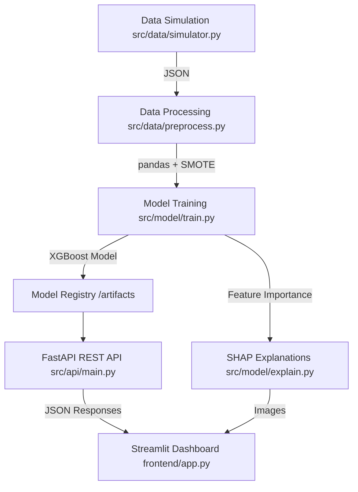

# Automated Insurance Fraud Detection System 🛡️

A modern, production-ready full-stack machine learning pipeline for detecting insurance fraud. 

This project transforms raw policy and claim data into actionable insights using an **XGBoost** classifier served by a high-performance **FastAPI** backend and visualized through an interactive **Streamlit** dashboard. Interpretability is prioritized using **SHAP** (SHapley Additive exPlanations) to provide local and global context to model decisions.

## 🌟 Key Features
- **Synthetic Data Generation**: Robust data simulation capabilities based on JSON schemas.
- **Data Engineering**: Handling imbalanced datasets explicitly using **SMOTE**.
- **Modern ML Model**: XGBoost replacing legacy Neural Network for superior tabular data performance.
- **Explainable AI (XAI)**: SHAP-powered visualizations to explain "black-box" decisions.
- **RESTful API**: FastAPI backend to serve single and batch predictions.
- **Interactive UI**: Streamlit dashboard for real-time model interaction and exploratory analysis.
- **Docker Ready**: Fully containerized using `docker-compose` for local and cloud deployment.

---

## 🏗️ Architecture Design



---

## 🛠️ Project Structure

```text
AutomatedInsuranceFraudDetectionSystem/
│
├── artifacts/            # Trained ML models and scalers
├── config/               # Configuration settings (YAML)
├── data/                 # Raw and processed datasets
│   ├── raw/
│   └── processed/
├── frontend/             # Streamlit UI dashboard
│   ├── app.py
│   └── static/images/    # SHAP interpretability plots
├── src/                  # Core source code
│   ├── api/              # FastAPI application
│   ├── data/             # Data simulation and preprocessing
│   ├── model/            # Model training and SHAP explainability
│   └── utils/            # Shared utilities (logging, exceptions)
├── docker-compose.yml    # Docker orchestration
├── Dockerfile.api        # Backend API container
├── Dockerfile.frontend   # UI container
└── requirements.txt      # Project dependencies
```

---

## 🚀 Setup Instructions

### Option 1: Docker (Recommended)
Prerequisites: Docker and Docker Compose installed.

1. Clone the repository:
   ```bash
   git clone https://github.com/goutham-05-raj/InsuranceDetection.git
   cd InsuranceDetection
   ```
2. Build and run the containers:
   ```bash
   docker-compose up --build
   ```
3. Access the services:
   - **Streamlit Dashboard**: `http://localhost:8501`
   - **FastAPI Docs (Swagger)**: `http://localhost:8000/docs`

### Option 2: Local Python Environment
Prerequisites: Python 3.10+ installed.

1. Install dependencies:
   ```bash
   pip install -r requirements.txt
   ```
2. Generate Synthetic Data:
   ```bash
   python -m src.data.simulator
   ```
3. Train the Model:
   ```bash
   python -m src.model.train
   ```
4. Generate SHAP Explanations:
   ```bash
   python -m src.model.explain
   ```
5. Run the FastAPI Server:
   ```bash
   uvicorn src.api.main:app --reload --host 0.0.0.0 --port 8000
   ```
6. Run the Streamlit Dashboard (In a new terminal):
   ```bash
   streamlit run frontend/app.py
   ```

---

## 💬 Explainable AI (SHAP)
Because fraud detection is highly sensitive, we employ SHAP to understand model outputs. Navigate to the **Model Explainability** page in the dashboard to see:
- **Global Feature Importance**: Which features drive fraud across the entire dataset.
- **Local Interpretability**: How precisely the model calculated the fraud probability for the specific claim you queried.

---

## 📜 License
Distributed under the MIT License.
